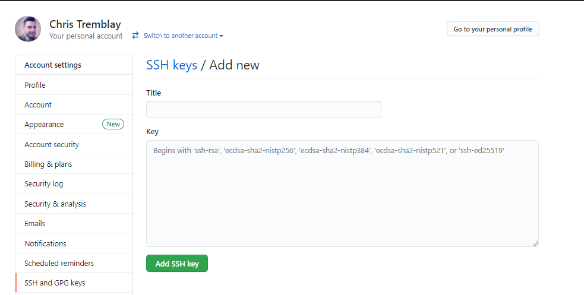

# 00 - Setup your environment

**This guide is part of the [Azure Pet Store App Dev Reference Guide](../README.md)**

In this section, we'll begin to set up your environment both for local development (Optional) and for Azure.

---

## Forking the azure-cloud repository

Forking this repository is probably the easiest way to get started ensuring that you're able to make changes as needed while also easily fetching future changes as the become available. I also encourage pull requests for documentation change request(s), defect(s) and feature suggestions :)

Head to https://github.com/chtrembl/azure-cloud and select Fork in the top right

You should see something similar to the below image:


Clone this fork in your tool of choice (GitHub Desktop or command line)

Either


or

```
git clone git@github.com:youralias/azure-cloud.git
```

Make sure you have an SSH key defined within your GitHub Settings

```
ssh-keygen -t rsa -b 4096 -C "youremailaddress"
```

You should see something like the following (if you do not yet have a key, following the instructions and enter a passphrase)

```
ssh-keygen -t rsa -b 4096 -C "chtrembl@microsoft.com"
Generating public/private rsa key pair.
Enter file in which to save the key (C:\Users\chtrembl/.ssh/id_rsa):
Created directory 'C:\Users\chtrembl/.ssh'.
Enter passphrase (empty for no passphrase):
Enter same passphrase again:
Your identification has been saved in C:\Users\chtrembl/.ssh/id_rsa.
Your public key has been saved in C:\Users\chtrembl/.ssh/id_rsa.pub.
The key fingerprint is:
SHA256:RiO8...
```

If you are prompted with a warning that this key already exists, then cancel that task 'n' and move on to the next step

copy the contents of the key to your clipboard (using your path to your id_rsa.pub)

```
more  C:\Users\chtrembl/.ssh/id_rsa.pub
```

With the contents of id_rsa.pub on your clipboard, head to your GitHub Profile > Settings and locate SSH Keys to add a new one. Paste in your clipboard key and give it a name and Save.

You should see something similar to the below image:



You're now able to update your GitHub Clone, of the https://github.com/chtrembl/azure-cloud Fork, with updates from he upstream https://github.com/chtrembl/azure-cloud Repo which allows you to work on your fork while still fetching upstream changes, when needed.

```
git remote add upstream git@github.com:chtrembl/azure-cloud.git
```

Now to pull https://github.com/chtrembl/azure-cloud changes at any point in time

```
git fetch upstream
```

```
git checkout main
```

```
git merge upstream/main
```

This will put any changes you may have, on top of the latest from https://github.com/chtrembl/azure-cloud and you can push into your origin as you normally would

## Creating Azure Resources

To save time, we have an ARM template to get a few Azure resources created:

- App Service (Pet Store Application)
- App Service Plan (Resources needed to host the Pet Store Application)
- Container Registry (Used to store Docker Images for Pet Store Application and Pet Store Service)

> 📝 Please Note, All other Azure Services such as Azure B2C, Azure Kubernetes Service, Azure Application Insights, API Management etc... will be setup in the subsequent guides.

Go ahead and Deploy to Azure

[](https://portal.azure.com/#create/Microsoft.Template/uri/https%3A%2F%2Fraw.githubusercontent.com%2Fchtrembl%2Fazure-cloud%2Fmain%2Fpetstore%2F00-setup-your-environment%2Fazuredeploy.json)

> 📝 Please Note, Create a new resource when prompted, such as: **azurepetstorerg** and substitute your network alias for **youralias**, or something unique that will appear as a FQDN for accessing your Azure Pet Store Application.

You should see something similar to the below image:


> ⏱ The resource provisioning will take some time. **Do not wait!** Continue with the guides. Remember your Resource Group!

If you head over to your Azure Resource Group (once completed) You should see something similar to the below image:


---

> 📝 Please note, if your not interested in building/deploying locally, you can certainly skip ahead and leverage Azure DevOps Pipelines and GitHub Actions to do the build & deploys for you and you can safely jump head to [03-configure-app-service-for-cd](../03-configure-app-service-for-cd/README.md) otherwise please continue to the next guide.

➡️ Next guide: [01 - Build the Docker Images](../01-build-the-docker-images/README.md)
